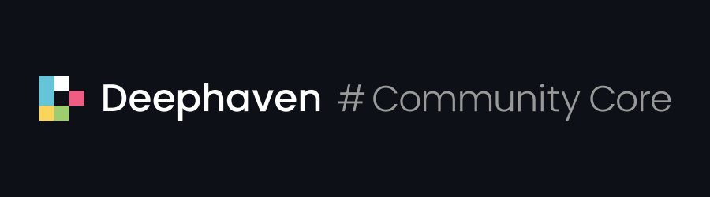
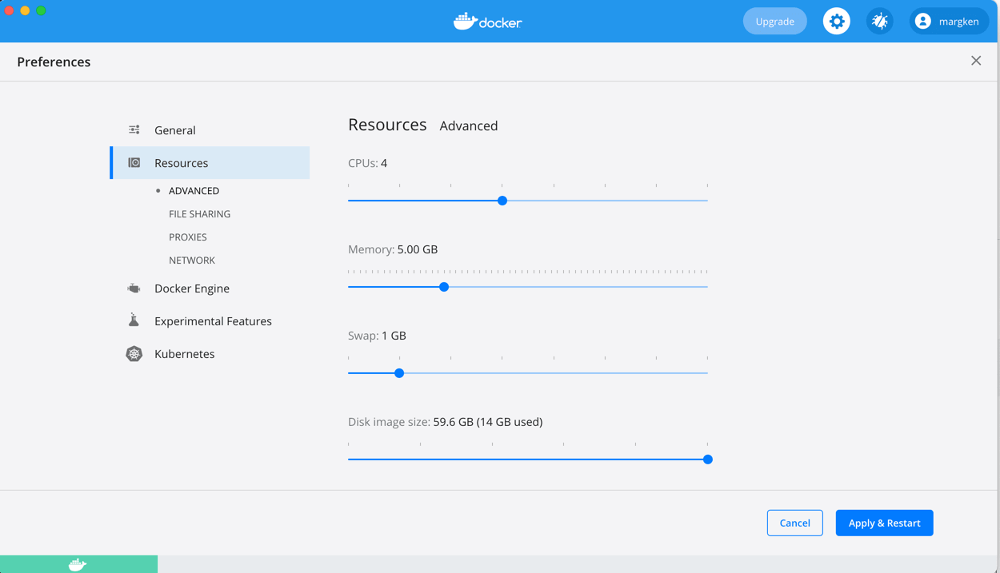
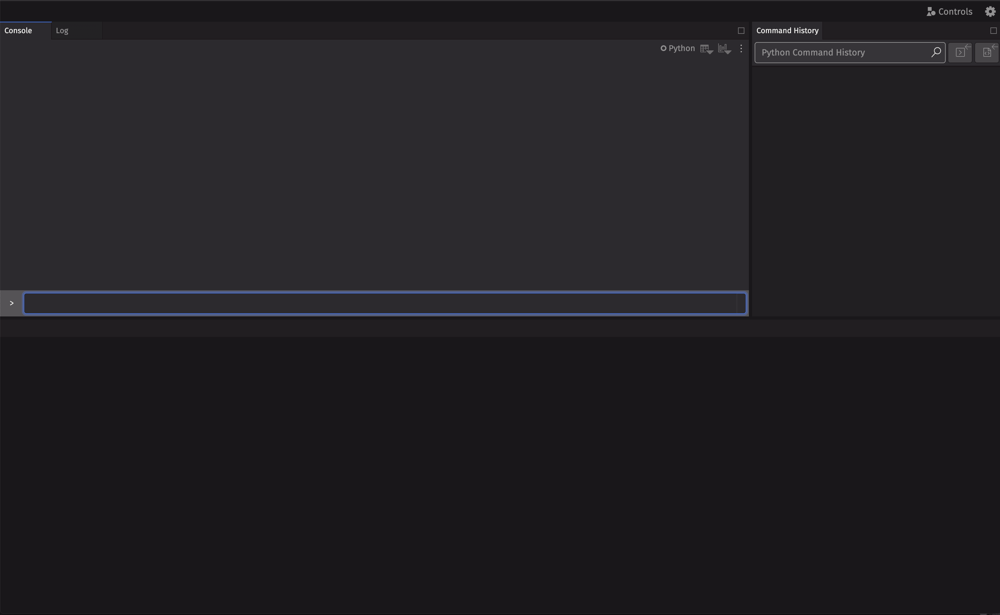
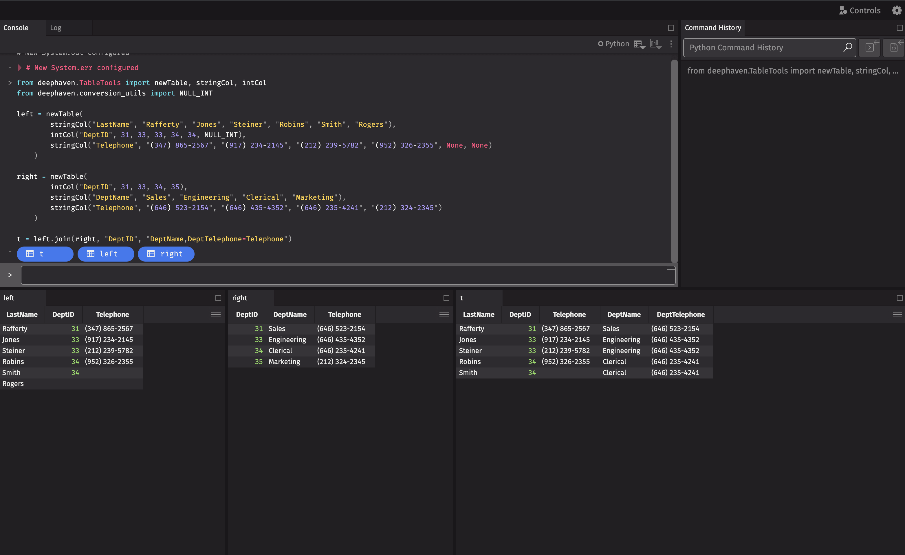

# Deephaven Community Core



Deephaven Community Core is a real-time, time-series, column-oriented analytics engine
with relational database features.
Queries can seamlessly operate upon both historical and real-time data.
Deephaven includes an intuitive user experience and visualization tools.
It can ingest data from a variety of sources, apply computation and analysis algorithms
to that data, and build rich queries, dashboards, and representations with the results.

Deephaven Community Core is an open version of [Deephaven Enterprise](https://deephaven.io),
which functions as the data backbone for prominent hedge funds, banks, and financial exchanges.


## Supported Languages

| Language      | Server Application | Client Application (OpenAPI) |
| ------------- | ------------------ | ---------------------------- |
| Python        | Yes                | No                           |
| Java / Groovy | Yes                | No                           |
| JavaScript    | No                 | Yes                          |
| gRPC          | -                  | Yes                          |

## Running Deephaven

### Required Dependencies

Building and running Deephaven requires a few software packages.
1. `git`
2. `java`
3. `docker`
4. `docker-compose`
5. (Windows) [WSL 2](https://docs.microsoft.com/en-us/windows/wsl/install-win10)

You can check if these packages are installed and functioning by running:
```
git version
java -version
docker-compose version
docker run hello-world
```

<details>
  <summary>Installing Java...</summary>

  Deephaven can be built with either [Oracle JDK](https://www.oracle.com/java/technologies/javase/javase-jdk8-downloads.html)
   or [OpenJDK](https://openjdk.java.net/install/).  Java 8 is required.  To install Java, run
  * Mac
      ```
      brew install openjdk@8
      ```
      OpenJDK 8 may need to be added to your path:
      ```
      echo 'export PATH="/usr/local/opt/openjdk@8/bin:$PATH"' >> ~/.zshrc
      ```
  * Windows WSL2 - Ubuntu
      ```
      sudo apt update
      sudo apt install openjdk-8-jdk-headless
      ```
  * Linux
      ```
      sudo apt update
      sudo apt install openjdk-8-jdk
      ```
    or
      ```
      sudo yum install java-1.8.0-openjdk
      ```
</details>

<details>
  <summary>Installing Docker...</summary>

  Instructions for installing and configuring Docker can be found at
  [https://docs.docker.com/get-docker/](https://docs.docker.com/get-docker/).  Windows users should follow the WSL2 instructions.
  Docker Engine Version 18.03 (or newer) is needed to build.
  Docker Engine Version 19.03 (or newer) is needed to build and run.
 

  Instructions for installing and configuring `docker-compose` can be found at
  [https://docs.docker.com/compose/install/](https://docs.docker.com/compose/install/).
  Version 1.29 (or newer) is recommended; Version 1.27 (or newer) is required.
</details>

<details>
  <summary>Docker RAM settings...</summary>

  Tests run as part of the build process require at least 4GB of Docker RAM.  To check your Docker configuration, run:
  ```
  docker info | grep Memory
  ```

  By default, Docker on Mac is configured with 2 GB of RAM.  If you need to increase the memory on your Mac, click
  on the Docker icon on the top bar and navigate to `Preferences->Resources->Memory`.

  
</details>

<details>
  <summary>If <code>docker run hello-world</code> does not work...</summary>

  If `docker run hello-world` does not work, try the following:
  1. [Is Docker running?](https://docs.docker.com/config/daemon/#check-whether-docker-is-running)
      ```
      docker info
     ```
  2. (Linux) [Are you in the `docker` user group?](https://docs.docker.com/engine/install/linux-postinstall/)
      ```
      sudo groupadd docker
      sudo usermod -aG docker $USER
      ```
</details>


### Checkout & Build Deephaven

Once all of the required dependencies are installed and functioning, run:
```
    git clone git@github.com:deephaven/deephaven-core.git
    cd deephaven-core
    ./gradlew prepareCompose
    docker-compose build
```
These commands will create:
 1. a `deephaven-core` directory containing the source code.
 2. Docker images containing everything needed to launch Deephaven.

### Run Deephaven Database (Python)

From the `deephaven-core` directory, run
```
    docker-compose up
```
This will start the database.  The console will fill with status and logging output.

Killing the process (e.g. `Ctrl+C`) will stop Deephaven.

### Run Deephaven Database (Groovy)

From the `deephaven-core` directory, run
```
    docker-compose --env-file default_groovy.env up
```
This will start the database.  The console will fill with status and logging output.

Killing the process (e.g. `Ctrl+C`) will stop Deephaven.

### Run Deephaven IDE

Once Deephaven Database is running, you can launch a Deephaven IDE in your web browser.  Deephaven IDE allows you
to interactively analyze data and develop new analytics.

- If Deephaven Database is running locally,
navigate to [http://localhost:10000/ide/](http://localhost:10000/ide/).
- If Deephaven Database is running remotely, navigate
to `http://<hostname>:10000/ide/`, where `<hostname>` is the address of the machine Deephaven Database is running on.



# First Query

From the Deephaven IDE, you can perform your first query.

This script creates two small tables: one for employees and one for departments.
It joins the two tables on the DeptID column to show the name of the department
where each employee works.

```python

from deephaven.TableTools import newTable, stringCol, intCol
from deephaven.conversion_utils import NULL_INT

left = newTable(
        stringCol("LastName", "Rafferty", "Jones", "Steiner", "Robins", "Smith", "Rogers"),
        intCol("DeptID", 31, 33, 33, 34, 34, NULL_INT),
        stringCol("Telephone", "(347) 555-0123", "(917) 555-0198", "(212) 555-0167", "(952) 555-0110", None, None)
    )

right = newTable(
        intCol("DeptID", 31, 33, 34, 35),
        stringCol("DeptName", "Sales", "Engineering", "Clerical", "Marketing"),
        stringCol("Telephone", "(646) 555-0134", "(646) 555-0178", "(646) 555-0159", "(212) 555-0111")
    )

t = left.join(right, "DeptID", "DeptName,DeptTelephone=Telephone")
```




## Resources
* [Help!](https://github.com/deephaven/deephaven-core/discussions/969)
* [Discussions](https://docs.github.com/en/discussions)
* [deephaven.io](https://deephaven.io)
* [Deephaven Community Core docs](https://deephaven.io/core/docs/)
* [Java API docs](https://deephaven.io/core/javadoc/)
* [Python API docs](https://deephaven.io/core/pydoc/)

## Code Of Conduct

This project has adopted the [Contributor Covenant Code of Conduct](https://www.contributor-covenant.org/version/2/0/code_of_conduct/).
For more information see the [Code of Conduct](CODE_OF_CONDUCT.md) or contact [opencode@deephaven.io](mailto:opencode@deephaven.io)
with any additional questions or comments.


## License

Copyright (c) Deephaven Data Labs. All rights reserved.

Provided under the [Deephaven Community License](LICENSE.md).
