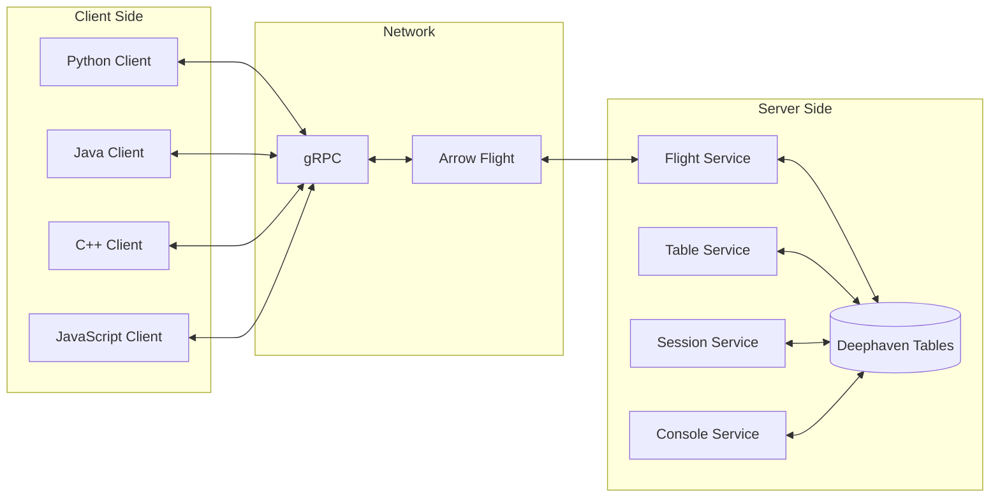
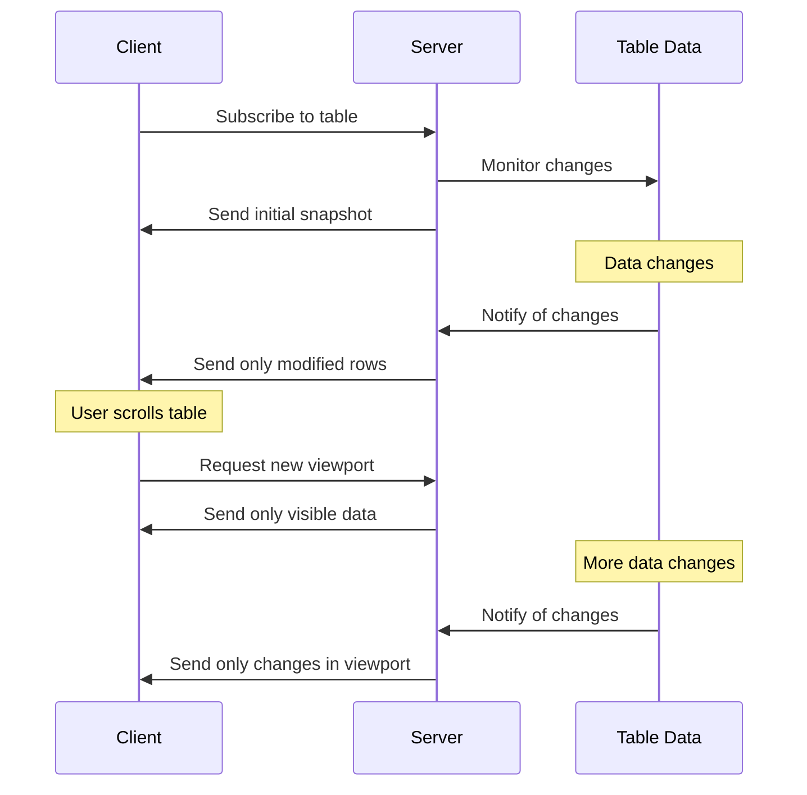

Deephaven offers both server-side and client-side APIs for multiple languages. But what should you use for your application? Is a server or client API the right choice for you? What about Python vs. Groovy? This guide provides some insight into servers and clients as a whole, as well as some Deephaven-specific recommendations.

## A mental model of servers and clients

### Servers

A server is a centralized process that runs on a machine and provides services to other processes. Servers typically run on machines dedicated to the server process; these machines typically have higher compute resources than client machines.

### Clients

A client is a decentralized process that runs on a machine and sends requests to one or more servers. Client machines typically have lower compute resources than server machines, and are often not dedicated to only the client process.

## A real-world analogy

Restaurants are a good real-world analogy for servers and clients. Consider the following basic components of a restaurant:

| Restaurant component | Software equivalent     | Description                                                     |
| -------------------- | ----------------------- | --------------------------------------------------------------- |
| Kitchen              | Server                  | The centralized processing center where requests are fulfilled. |
| Customers            | Clients                 | The decentralized processes that send requests to the kitchen.  |
| Wait staff           | Communications protocol | Transport requests between clients and the kitchen.             |

Even the process by which a restaurant serves its customers is similar to how servers and clients interact:

1. Initiation

- Restaurant: A customer enters the restaurant, is sat at a table, and orders food.
- Software: A client connects to a server, creates a session, and sends a request.

2. Request transmission

- Restaurant: A waiter takes the customer's order and ensures the kitchen receives it.
- Software: The request is serialized and transmitted over a network.

3. Request processing

- Restaurant: The kitchen prepares the food requested by the customer.
- Software: The server fulfills the client request.

4. Response transmission

- Restaurant: The kitchen notifies the wait staff that the food is ready, and a waiter/waitress transports the food to the customer.
- Software: The server finishes fulfilling the client request and a response is transmitted over a network back to the client.

5. Consumption

- Restaurant: The customer eats their food.
- Software: The client receives and uses the server's response to complete its task.

### Additional analogues

There are some other analogues that restaurants have to software. These can be useful in developing a mental model of servers and clients.

#### Scaling

Restaurants often face a busy dinner rush on holidays and weekends. In software, a busy dinner rush is akin to a high traffic load. This can be alleviated by:

- Having more workers (kitchen staff, wait staff, etc): In software, this is like vertical scaling. By adding more resources to a single server, you can handle more requests.
- Having more restaurants: In software, this is like horizontal scaling. By adding more servers, clients can send requests to different servers to avoid overloading a single server.

#### Load balancing

Many restaurants have an employee dedicated to helping the kitchen operate at its most efficient, called the expediter. The expediter handles the order in which orders are cooked, ensuring the kitchen is working at high efficiency. This is akin to a load balancer, which distributes requests across server(s) as to not overload a single process with too many.

#### Authentication and authorization

If a customer orders an alcoholic drink, the server typically checks that customer's ID to ensure that they are of legal drinking age. In software, this is akin to authentication and authorization, ensuring that a client is who they claim to be and has the proper permissions to access the server.

## Deephaven's servers and clients

Deephaven Community Core offers two server-side APIs:

- [Python](https://deephaven.io/core/pydoc/)
- [Groovy](https://deephaven.io/core/javadoc/)

There are also client-side APIs for multiple languages:

- [Python](https://docs.deephaven.io/core/client-api/python/)
- [Java](https://deephaven.io/core/javadoc/)
- [C++](https://docs.deephaven.io/core/client-api/cpp/)
- [R](https://docs.deephaven.io/core/client-api/r/)
- [JavaScript](https://docs.deephaven.io/core/client-api/javascript/modules/dh.html)
- [Go](https://pkg.go.dev/github.com/deephaven/deephaven-core/go)

## Technical Implementation

Deephaven's client-server architecture is built on modern, high-performance technologies designed for real-time data processing:

### Communication Protocol

Deephaven uses [gRPC](https://grpc.io/) as its communication framework, providing:

- Cross-language compatibility (supporting Python, Java, C++, etc.)
- Bidirectional streaming capabilities
- Efficient binary serialization

### Data Transport

For efficient data transfer between clients and servers, Deephaven leverages:

- **Apache Arrow Flight**: A protocol for high-performance data transport that maintains columnar data format during transfer
- **Barrage**: Deephaven's extension to Arrow Flight that enables incremental table updates, allowing clients to receive only the changes to data rather than entire tables

### Update Model

One of Deephaven's key features is its incremental update model:

- Tables on the server can change over time ("tick")
- Only the changes (additions, removals, modifications) are sent to clients
- Clients can subscribe to specific viewports (subsets of rows and columns) to minimize network traffic

### Client-Server Interaction

Clients interact with the Deephaven server through several services:

- **Table Service**: Allows clients to create and manipulate tables on the server
- **Session Service**: Manages client connections and resources
- **Console Service**: Enables clients to execute code on the server
- **Flight Service**: Handles the actual data transfer between client and server

This architecture enables Deephaven to provide real-time data processing capabilities across distributed systems while minimizing network overhead.

## Performance Considerations

When choosing between server-side and client-side APIs, performance is a critical factor to consider:

### Data Volume and Processing

- **Server-side processing** excels when working with large datasets, as data remains on the server without network transfer overhead
- **Client-side processing** introduces network latency and bandwidth constraints when transferring large volumes of data

### Incremental Updates

- Deephaven's incremental update model significantly reduces network traffic by sending only changes rather than entire tables
- For frequently updating tables, this can improve performance by orders of magnitude compared to traditional request-response patterns

### Resource Utilization

- **Server resources** are typically more powerful but shared among multiple users/processes
- **Client resources** may be more limited but dedicated to a single user's tasks
- Complex operations (joins on large tables, complex aggregations) are generally more efficient when performed server-side

### Viewport Optimization

- Client applications can request specific "viewports" (subsets of data) to minimize unnecessary data transfer
- This is particularly important for interactive applications where users only need to see a portion of a large dataset

### Latency Considerations

- Operations that require low latency should minimize network round-trips
- Chained operations performed entirely server-side avoid multiple network hops
- Client-side operations on already-transferred data eliminate network latency entirely

## Security Considerations

Security is a critical aspect when designing and implementing client-server systems:

### Authentication and Authorization

- Deephaven supports multiple authentication mechanisms including Pre-Shared Key (PSK) and OpenID Connect (OIDC)
- Client connections are authenticated before access is granted to server resources
- Authorization controls determine what operations clients can perform on specific data

### Data Protection

- Communication between clients and servers can be encrypted using TLS
- Sensitive data can remain on the server, with only authorized views exposed to clients
- Viewport mechanisms allow fine-grained control over what data is accessible to which clients

### Network Security

- Server deployments can be configured with appropriate network isolation
- API access can be restricted to specific network segments or VPNs
- Firewall rules should be configured to limit exposure of server ports

### Code Execution

- The Console Service allows clients to execute code on the server, requiring careful access control
- Consider the security implications when granting code execution privileges to client applications
- Server-side validation should be implemented for all client requests

## Recommendations

There are reasons to use either a server or client API. The recommendations for Deephaven's APIs are as follows.

### When to use a server-side API

The Deephaven Community Server is a lightweight application that can be run with as little as 4GB of RAM. It scales well with hardware, meaning it can handle both low- and high-throughput workloads similarly. Use a server-side API when:

- You run Deephaven on a single machine.
- You want to interact with the server directly.
- There is no need to distribute the workload.
- You want to use the Deephaven IDE for your development.

### When to use a client-side API

Deephaven's client APIs provide a versatile suite of tools for interacting with the server. Not only can you manipulate data from the client itself, but you can also run code server-side from the client. Use a client-side API when:

- You need to use Deephaven when you're not where the machine is running the server.
- You want to use a language other than Python or Groovy.
- You don't need the web IDE experience.
- You want to integrate Deephaven in with resources only available on other machines.

## Related documentation

<!-- TODO: Put more stuff here once this is fully fleshed out. -->

- [Core API design](./deephaven-core-api.md)
